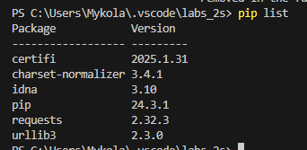
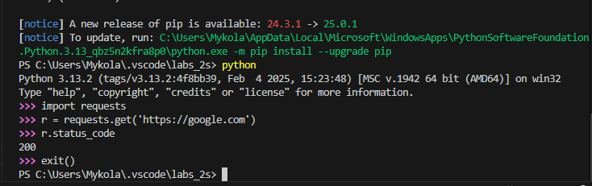
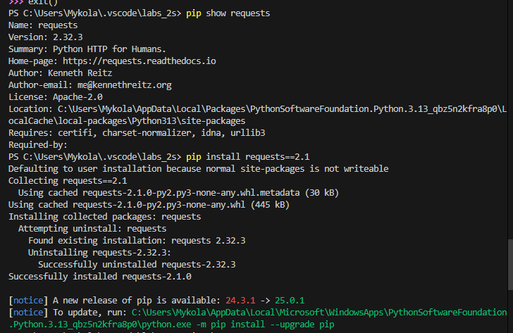
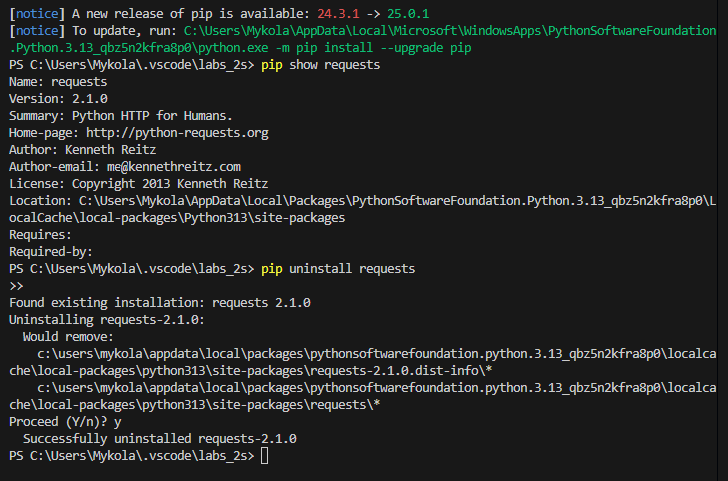
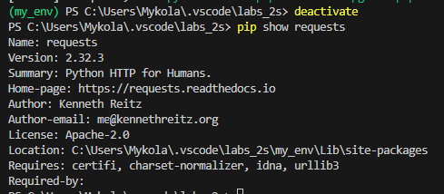
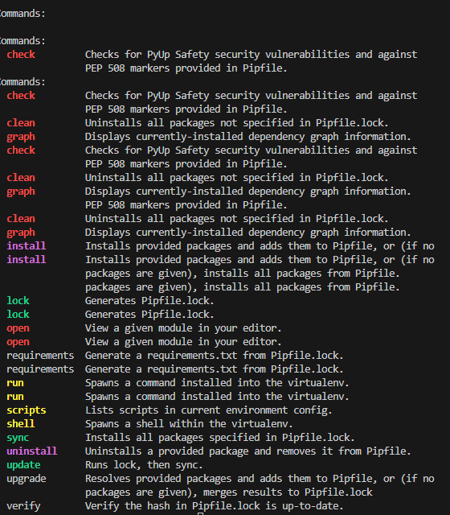
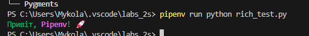
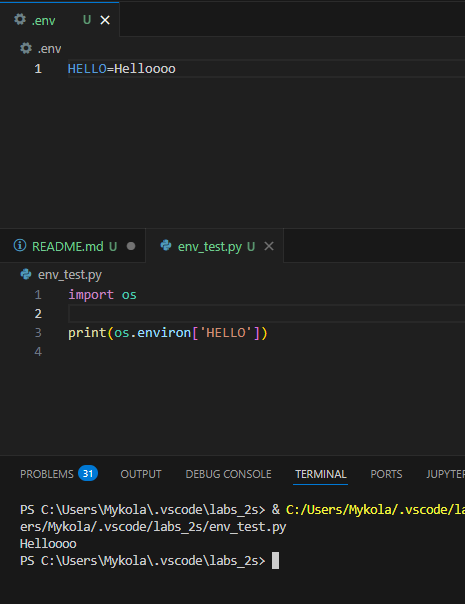
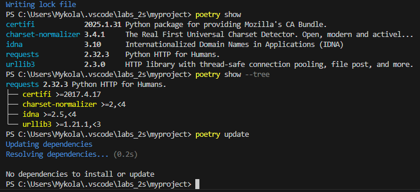
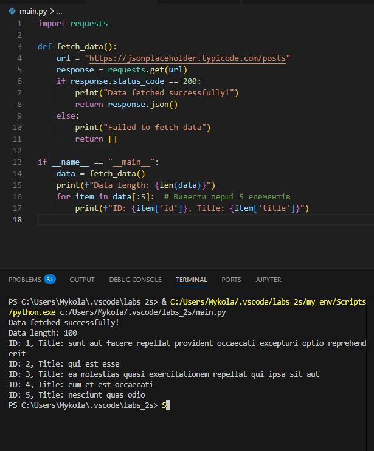

# Звіт до роботи 1
## Тема: Віртуальні середовища
### Мета роботи: Ознайомитися з сторонніми бібліотеками, з віртуальним середовищем, з Pipenv, з змінними середовищами, з Poetry.

---
### Виконання роботи
* Результати виконання завдання ;
    1. Ознайомився з сторонніми бібліотеками, з віртуальним середовищем, з Pipenv, з змінними середовищами, з Poetry.
    1. Навчився працювати з сторонніми бібліотеками, з віртуальним середовищем, з Pipenv, з змінними середовищами, з Poetry.
---
### 1. Основи роботи з сторонніми бібліотеками:

#### Встановлені бібліотеки:

#### Результат виконання команд

#### Результат виконання команд


---
### 2. Робота у віртуальному середовищі


Бібліотека встановлена лише у папці my_env і не доступна глобально.
---
### 3. Робота з Pipenv
- Команди які можна виконувати за допомогою pipenv:

- Файли Pipfile та Pipfile.lock створились. 
Pipfile — список бібліотек, необхідних для проєкту.
Pipfile.lock — зафіксовані версії бібліотек для стабільної роботи.
- Запустивши програму нижче, різними способами, мені вивело велику кількість коду.
``` 
import requests

response = requests.get('https://httpbin.org/')
for line in response.iter_lines():
    print(line)
```
- Приклад бібліотеки Pypi. Rich.
```
from rich.console import Console

console = Console()
console.print("Привіт, [bold magenta]Pipenv[/bold magenta]! 🚀", style="green")

```

---
### 4. Робота зі змінними середовища


Якщо виконати скрипт без активації віртуального середовища Python не зможе отримати значення змінної.
---
### 5. Робота з Poetry
- Виконання команд:

- Програма АІ:

---
### 6. Допомога ChatGPT
Щоб створити простий вебсайт за допомогою Flask та використати код програми, написаний у попередніх завданнях, для виведення на одну з веб-сторінок, виконайте наступні основні кроки:
1. Створення та налаштування Flask-проекту
2. Написання основного Flask-додатку
3. Створення HTML-шаблону
4. Запуск Flask-додатку
5. Перевірка роботи
6. Налаштування додаткових функцій (за бажанням)
---
### Висновок:
- :question: Що зроблено в роботі;
    1.  Ознайомився з сторонніми бібліотеками, з віртуальним середовищем, з Pipenv, з змінними середовищами, з Poetry.
- :question: Чи досягнуто мети роботи;
    1. Мети досягнуто.
- :question: Які нові знання отримано;
    1. Навчився працювати з сторонніми бібліотеками, з віртуальним середовищем, з Pipenv, з змінними середовищами, з Poetry.
- :question: Чи вдалось відповісти на всі питання задані в ході роботи;
    1. Так, всі питання, що виникали в ході роботи, були вирішені.
- :question: Чи вдалося виконати всі завдання;
    1. Так, всі завдання виконано успішно.
- :question: Чи виникли складності у виконанні завдання;
    1. Не видалявся реквест.


---