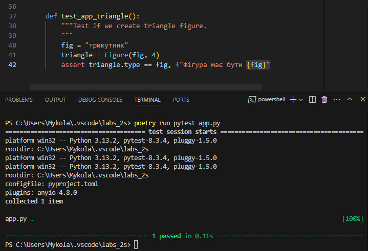

# Звіт до роботи 2
## Тема: Тестування
### Мета роботи: Навчитися перевіряти значення за допомогою assert, писати юніт тести та візуалізувати результати та покриття коду Coverage.

---
### Виконання роботи
### 1. Перевірка assert

#### Результат виконання команд (власний крок assert)

#### Результат виконання команд (ООП методи assert)

#### Результат виконання команд (умовне розгалуження)

---

### 2. Юніт тести
#### Результат виконання команд (простий клас з двома пропертями)

#### Результат виконання команд (виклик тестів)

#### Розширений функціонал класу та юніт тест

[Переглянути код тестів](../test_app.py)
---

### 3. Юніт тести з використання бібліотеки PyTest

---
### 4. Візуалізація результатів та покриття коду Coverage (pytest-cov)

---
### Висновок:
- :question: Що зроблено в роботі;
    1.  Перевірено значення за допомогою assert, написано юніт тести та візуалізувано результати та покриття коду Coverage.
- :question: Чи досягнуто мети роботи;
    1. Мети досягнуто.
- :question: Які нові знання отримано;
    1. Навчився перевіряти значення за допомогою assert, писати юніт тести та візуалізувати результати та покриття коду Coverage.
- :question: Чи вдалось відповісти на всі питання задані в ході роботи;
    1. Так, всі питання, що виникали в ході роботи, були вирішені.
- :question: Чи вдалося виконати всі завдання;
    1. Так, всі завдання виконано успішно.
---