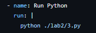
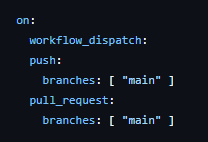
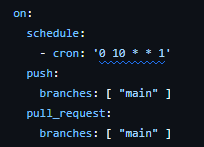
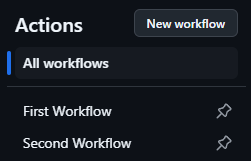
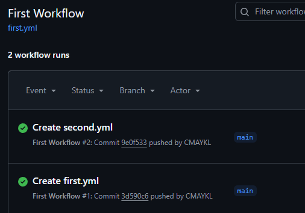
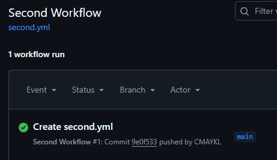
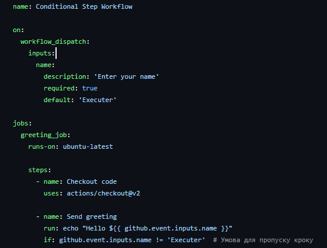
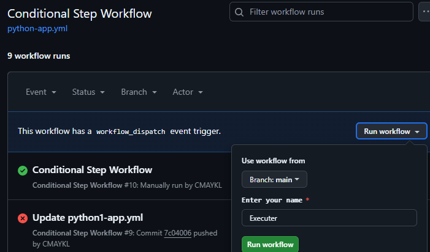

# Звіт до роботи 3
## Тема: Автоматизація за допомогою GitHub Actions
### Мета роботи: Налаштувати автоматизацію за допомогою GitHub Actions для перевірки та тестування Python коду, інтеграції з Codecov і генерації баджів для статусу виконання.

---
## Виконання роботи
#### Створення першого Workflow з шаблону
Було створено перший Workflow з шаблону Python application

### Редагування Workflow
крок який запускає код програми

### Запуск Workflow вручну та по Cron
Ручний запуск

Заданий час виконання на вибраний день в тижні та інша годину.

### Створення декількох Workflow або завдань
Створені два файли workflow

Результат виконаних завдань

### Перевірка умов для запуску завдань або кроків
Цей код використовує умову `if`, щоб пропустити виконання кроку, якщо передане ім’я дорівнює `'Executer'`.

### Баджі та статуси
Згенерований бадж:

### Інтеграція з Coverage (Додатково)

## Висновок:
- :question: Що зроблено в роботі;
    1.  Створено два файли Workflow для автоматизації тестування коду, налаштовано запуск вручну та за розкладом, додано умови для виконання кроків, інтеграцію з Coverage та Codecov, а також додано баджі для статусу виконання в README.
- :question: Чи досягнуто мети роботи;
    1. Мети досягнуто.
- :question: Чи вдалось відповісти на всі питання задані в ході роботи;
    1. Так, всі питання,  що виникали в ході роботи, були вирішені.
- :question: Чи вдалося виконати всі завдання;
    1. Так, всі завдання виконано успішно.
---